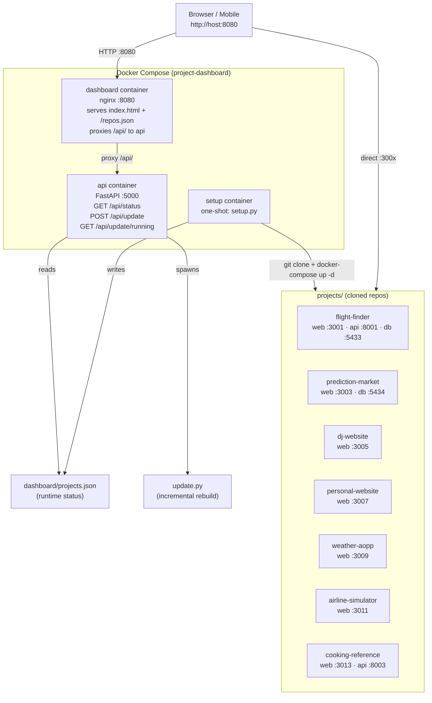

# Project Dashboard — System Architecture

## Port Map

| Service | Port |
|---|---|
| Dashboard (nginx) | 8080 |
| API (FastAPI) | 5000 |
| Flight Finder frontend | 3001 |
| Flight Finder backend | 8001 |
| Flight Finder db | 5433 |
| Prediction Market frontend | 3003 |
| Prediction Market db | 5434 |
| DJ Website | 3005 |
| Personal Website | 3007 |
| Weather App | 3009 |
| Airline Simulator | 3011 |
| Cooking Reference frontend | 3013 |
| Cooking Reference backend | 8003 |

## Data Flow

1. `docker-compose up` starts **setup** (one-shot), **api**, and **dashboard** containers.
2. **setup.py** clones each repo in `repos.json`, copies `envs/<name>.env` if present, runs `docker-compose up -d --build` in each project dir with configured ports, writes status to `dashboard/projects.json`.
3. **api.py** exposes `/api/status` (reads `projects.json`) and `/api/update` (runs `update.py` in background).
4. **nginx** serves `dashboard/index.html` + `repos.json` and proxies `/api/` to the api container.
5. **update.py** fetches each remote, skips unchanged repos, rebuilds only what changed.
